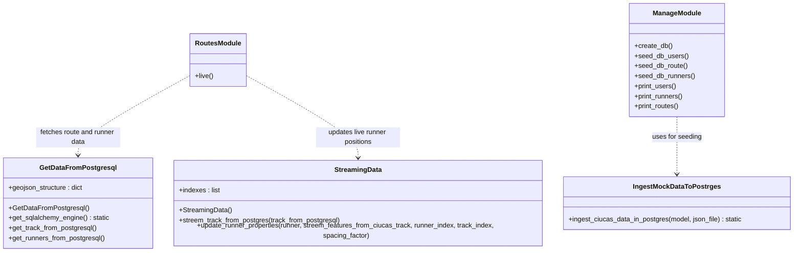

# 🏃‍♂️ Real-Time Ultramarathon Tracker API


A **Flask-based API** for streaming **mock real-time geospatial data** of runners during an ultramarathon competition. This project processes **GeoJSON files** representing runners and the track, and generates **live location and distance** updates for each participant.

---

## 🚀 Features

- Simulates real-time GPS tracking of runners
- Processes and streams geospatial data
- Includes full runner management from the web UI: create, edit, and delete
- Built with Flask, served with Gunicorn + Nginx
- Dockerized for easy production deployment

---

## ✍️ Runner Data Management

The web app is not just a read-only viewer. It also supports basic CRUD operations for runner data:

- Create new runner entries
- Edit existing runner details
- Delete runner entries

These actions are available from the `/register_runners` flow and related forms, making it possible to maintain runner data directly from the UI.

---

## 🏗️ Architecture Overview

At a high level, the project follows this flow:



- Raw route and runner data starts as GeoJSON files
- Preprocessing scripts normalize and enrich that data before ingestion
- PostgreSQL stores both route points and runner records
- Flask exposes the data through the `/live` API and the runner management UI
- An external map client consumes the `/live` endpoint for simulated real-time visualization

---

## 🛠️ How to Run (Development)

1. Clone this repo and `cd` into it.
2. Copy and edit the following environment files in the project root:
   - `.env.dev`
   - `.env.dev.db`
3. (Recommended) Stop and remove previous containers, including orphans and volumes:
	```sh
	docker compose -f docker-compose.dev.yml down --remove-orphans -v
	```
	Then build and start the development containers:
	```sh
	docker compose -f docker-compose.dev.yml up -d --build
	```
4. (Optional) Preprocess data inside the container:
	```sh
	docker compose -f docker-compose.dev.yml exec web bash
	python process_data/get_distance.py
	python process_data/trim_json.py
	```
5. Seed the development database (including users):
	```sh
	docker compose -f docker-compose.dev.yml exec web python manage.py create_db
	docker compose -f docker-compose.dev.yml exec web python manage.py seed_db_users  # Use only in development!
	docker compose -f docker-compose.dev.yml exec web python manage.py seed_db_route
	docker compose -f docker-compose.dev.yml exec web python manage.py seed_db_runners
	```
	> **Note:** The seed_db_users command is intended for development only. Do not use it in production as it inserts mock/test users.


6. **To fully reset and clean up your development environment, run:**
	```sh
	docker compose -f docker-compose.dev.yml down --remove-orphans -v
	```
7. Open [http://127.0.0.1:8080/register_runners](http://127.0.0.1:8080/register_runners) to see the data table.
8. For live data, visit [http://127.0.0.1:8080/live](http://127.0.0.1:8080/live).

---

## 🛠️ How to Run (Production)

1. Ensure `.env.prod` and `.env.prod.db` exist in the project root (see below for example content).
2. Build and run containers using the Makefile:
   ```sh
	make down
	make build
	make create-db
	make seed-route
	make seed-runners
	```
	> **Note:** Do not run any user seeding command in production. Only use `seed_db_users` in development.
	> **Deployment note:** Production-facing values such as ports and the public DNS name are read from `.env.prod`, so they can be changed without modifying the application code.

---

## ⚙️ Environment Files Example

**.env.dev.db**
```env
POSTGRES_USER=hello_flask
POSTGRES_PASSWORD=hello_flask
POSTGRES_DB=hello_flask_dev
POSTGRES_HOST=db
POSTGRES_PORT=5432
DATABASE_URL=postgresql://hello_flask:hello_flask@db:5432/hello_flask_dev
```

**.env.dev**
```env
FLASK_APP=project/__init__.py
FLASK_DEBUG=1
APP_FOLDER=/home/app/web
SECRET_KEY="dev-secret-key"
```

**.env.prod.db**
```env
POSTGRES_USER=hello_flask
POSTGRES_PASSWORD=hello_flask
POSTGRES_DB=hello_flask_prod
POSTGRES_HOST=db
POSTGRES_PORT=5432
DATABASE_URL=postgresql://hello_flask:hello_flask@db:5432/hello_flask_prod
```

**.env.prod**
```env
MY_DNS="mydns.com"
FLASK_APP=project/__init__.py
FLASK_DEBUG=0
APP_FOLDER=/home/app/web
SECRET_KEY="prod-secret-key"
PGADMIN_DEFAULT_EMAIL="pgadmin4@pgadmin.org"
PGADMIN_DEFAULT_PASSWORD="admin"

WEB_PORT=5000
PGADMIN_PORT=5555
NGINX_PORT=1443
```
> **Note:** Adjust the above environment variable values as needed for your deployment.

---

## ✅ Validation (Print Data)

After seeding, you can print the contents of your tables to validate the data:

**Development:**
```sh
docker compose -f docker-compose.dev.yml exec web python manage.py print_users
docker compose -f docker-compose.dev.yml exec web python manage.py print_runners
docker compose -f docker-compose.dev.yml exec web python manage.py print_routes
```

**Production:**
```sh
make print-users
make print-runners
make print-routes
```

---

## 🧩 ETL Process: Data Preprocessing (Demo)

Before seeding the database (in either development or production), you may need to preprocess the raw data as part of the ETL (Extract, Transform, Load) workflow. This step applies to both environments, as this project is intended as a demo.

To start, open a shell inside the development web container:

```sh
docker compose -f docker-compose.dev.yml exec web bash
```

Inside the container, in the root directory, run the following scripts as needed:

1. **Generate distance for each runner:**
	```sh
	python process_data/get_distance.py
	```

2. **Prepare data for ingestion into PostgreSQL:**
	If `ciucas_runners.json` and `ciucas_route.json` do not exist in the `mock_data` folder, or if the data becomes corrupted, run:
	```sh
	python process_data/trim_json.py
	```

---

## 🖼️ Visualize Data

There are several ways to view and understand the real-time data provided by this project:

1. **Web App Views:**
	- Visit [http://127.0.0.1:8080/live](http://127.0.0.1:8080/live) to see the raw JSON data as it is streamed from PostgreSQL. This endpoint simulates real-time updates of runner locations and stats.
	- Go to [http://127.0.0.1:8080/register_runners](http://127.0.0.1:8080/register_runners) to see a user-friendly table displaying the runners as they are pulled from the database. This page is useful for quickly verifying the data in a readable format and for managing runner entries through clearly exposed create, edit, and delete actions.

2. **Database Visualization with pgAdmin:**
	- You can visually inspect and manage your PostgreSQL database using the pgAdmin web UI. Once your containers are running, open [http://localhost:5555](http://localhost:5555) in your browser. Log in with:
		- **Email:** the value configured in `.env.dev` or `.env.prod`
		- **Password:** the value configured in `.env.dev` or `.env.prod`
	- pgAdmin allows you to browse tables, run SQL queries, and view your data directly, making it easy to compare the web app’s output with the underlying database contents during development.

3. **Interactive Map Visualization:**
	- For a richer, map-based experience, the data from the `/live` endpoint is consumed by an external web app: [https://mapwizard.eu/projects/realtime-ultra/index.html](https://mapwizard.eu/projects/realtime-ultra/index.html). This app displays the runners' locations and stats on an interactive map, providing a real-time visual demo of the tracking system.

---

## 📚 Libraries Used

| Library | Purpose |
|---|---|
| **Flask** | Core web framework. Handles routing, blueprints, and the application factory pattern. |
| **Flask-SQLAlchemy** | ORM integration. Maps Python model classes (`Runners`, `CiucasRoute`, `User`) to PostgreSQL tables. |
| **Flask-Migrate** | Database migration management via Alembic. Tracks schema changes over time. |
| **Flask-Login** | Session-based user authentication. Protects routes with `@login_required` and manages current user state. |
| **Flask-CORS** | Cross-Origin Resource Sharing. Allows the external map front-end at `mapwizard.eu` to call the `/live` endpoint from a different origin. |
| **SQLAlchemy** | Low-level SQL toolkit. Used directly (without the Flask layer) for the streaming data path that reads from PostgreSQL via `pandas`. |
| **psycopg2-binary** | PostgreSQL driver. Used by both SQLAlchemy and the direct `psycopg2`-style connection string for raw DB access. |
| **pandas** | Data manipulation. Reads SQL query results directly into a `DataFrame` (`pd.read_sql_query`), which is then converted to GeoJSON-compatible dicts. |
| **Gunicorn** | Production WSGI server. Runs the Flask app inside the container, bound to the port exposed to Nginx. |
| **Werkzeug** | WSGI utilities. `ProxyFix` middleware corrects `X-Forwarded-*` headers so Flask generates correct redirect URLs behind Nginx. |
| **WTForms** | Form definitions and validation. Powers the runner search, new runner, and edit/delete forms. |
| **Flask-Babel** | Internationalisation support. Included for potential future locale/date formatting needs. |
| **haversine** | Geospatial distance calculation. Computes the great-circle distance between GPS coordinates to derive each runner's distance along the track. |
| **python-dotenv** | Loads `.env` files into the process environment at startup, keeping secrets out of source code. |
| **Jinja2** | Templating engine (bundled with Flask). Renders HTML views for the runner table, login, and profile pages. |

---

## 🧠 How the API Logic Works

The core idea is to simulate real-time GPS tracking of runners on a known race route, driven entirely by data stored in PostgreSQL.

### Data model

Two key tables are used:

- **`ciucas_route`** — ordered track points for the full race route, each with GPS coordinates (`xcoord`, `ycoord`), elevation (`ele`), and cumulative distance from the start.
- **`runners_ciucas`** — one row per runner with name, category, bib number, ranking, and finish time.

### Streaming logic (`/live` endpoint)

The `/live` endpoint returns a GeoJSON `FeatureCollection` of all runners, with each runner placed at a calculated position on the route. The position is determined using a spacing formula:

```
runner_position = (spacing_factor × runner_index + track_index) % total_track_points
```

This spreads runners across the track, with faster runners (lower rank) positioned further along the route. The result is a simulated snapshot of where each runner would be at that moment in the race.

Each call to `/live`:
1. Fetches all track points from `ciucas_route` via `pandas` + `SQLAlchemy`.
2. Fetches all runners from `runners_ciucas`, sorted by ranking.
3. Assigns each runner a position on the track based on the spacing formula.
4. Copies the track point's coordinates and elevation into the runner's GeoJSON properties.
5. Returns the full GeoJSON as a single JSON response.

The external map app at [mapwizard.eu](https://mapwizard.eu/projects/realtime-ultra/index.html) polls this endpoint and renders each runner as a moving marker on the map.

#### Access control for `/live`

The `/live` endpoint uses conditional access control rather than being either fully public or fully login-protected.

- Public access is allowed when the request comes from a trusted frontend, such as the configured mapwizard domain or localhost during development.
- Login is required for all other callers, including direct or untrusted origins.

This is implemented with the `live_login_required` decorator in `routes.py`, which compares the incoming request origin against the trusted origins derived from `CORS_ORIGINS`, `MY_DNS`, and `NGINX_PORT`.

Because the trusted DNS name and exposed ports are passed through `.env.prod`, the production deployment stays easy to reconfigure. If the domain or port mapping changes, you can update the environment file instead of changing the application logic.

This tradeoff keeps the map client usable without forcing end users through authentication, while still reducing casual scraping and unintended access from unrelated origins. If stricter protection is needed later, API keys or rate limiting would be the next logical step.

### ETL pipeline

Before the API can serve data, the raw GeoJSON files go through a preprocessing step:

1. **`process_data/get_distance.py`** — reads the raw route GeoJSON and adds a `distance` field to each point using the `haversine` formula.
2. **`process_data/trim_json.py`** — trims and normalises the runner and route data into the format expected by the database models.
3. **`manage.py seed_db_*`** — loads the preprocessed JSON files into PostgreSQL via `IngestMockDataToPostrges`.

---

## 📝 Project Summary

This project is a Dockerized Flask + PostgreSQL application that simulates real-time ultramarathon tracking from GeoJSON data.

It has two main responsibilities:
- Serve a `/live` GeoJSON API consumed by an external map client
- Provide a web UI to view, create, edit, and delete runner records

The data is preprocessed through a small ETL flow, loaded into PostgreSQL, and then exposed through both a live tracking endpoint and an admin-style runner management interface.

This repository showcases backend API design, data ingestion, CRUD workflows, geospatial data handling, and containerized deployment with Nginx and Gunicorn.

---

## 🎯 Skills Demonstrated

- Flask backend development and route design
- PostgreSQL data modeling and persistence
- CRUD workflow implementation for runner management
- ETL preprocessing for GeoJSON-based input data
- Geospatial data handling and live-style API output generation
- Containerized development and deployment with Docker, Gunicorn, and Nginx
